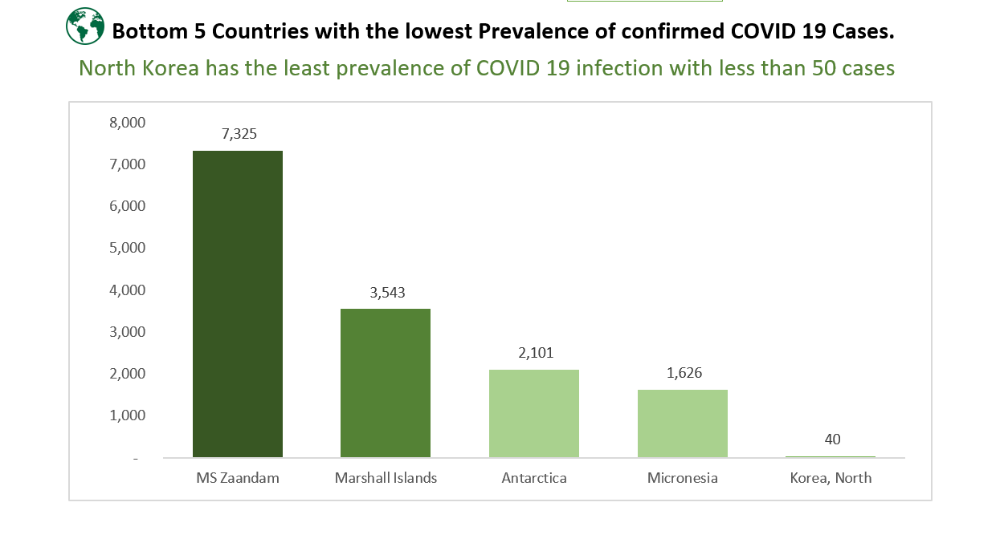

# Project Name: COVID-19 Exploratory Data Analysis
## Home Tab

This is my first excel project. Extraction, data cleaning and visualizations were done using Excel.
This project is in accordance with the NG30days of learning program. 
File comprises 7 tabs:
- Home
- Analysis
- Dashboard
- Datasets (Confirmed, Death, Recovered, and Consolidated)

------
# Project Objective

#### To analyze the top and bottom 5 countries with the highest and lowest prevalence of the Corona Virus infection from Jan 2020 to June 2022.

----
# Data Sourcing
#### Data was scraped from the web into excel so as to have a real-time update.
#### Three time series tables depicting the global confirmed cases, recovered cases and deaths were scraped from CSSEGISandData/COVID19 on GitHub.

-------
# Data Transformation
#### Analysis was done using Power Query Editor.
#### The three time series tables were merged to form the consolidate table.
#### Tables were named accordingly
#### New columns were created for corresponding month, year and day.
#### Analysis tab created for pivot tables which summarizes:
- Sum of confirmed and death cases
- Sum of confirmed cases by month and year
- Top and Botton 5 countries with sum of confirmed cases.

#### Dashboard tab was created for visualizations acording to pivot tables.

# Data Validation
#### Data validations applied accordingly

# User Interface and Navigation
##### Time series tables are hidden.
##### Icons are created and clickable for easy navigation.
##### Charts are locked to prevent unintentional distortion while pivot slicers and navigation icons unloked.

# Findings 
#### Less than 2% of the confirmed cases lead to death.

#### The United State has the highest prevalence of covid-19 infection.

#### North korea has the least preValence of Covid-19 infection with less than 50 cases.
